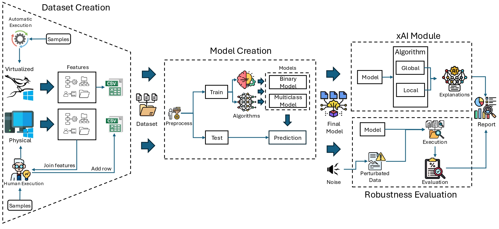

# 🧠 Ransomware Detection and Explainability with ML, MLP, xAI, and Robustness

---

## 📘 Repository Description

This repository implements a **comprehensive pipeline for ransomware detection, classification, and explanatory analysis** based on host telemetry.

It includes:

- 🔍 **Exploratory visualization** of data (PCA, UMAP, histograms, boxplots).
- ⚙️ **Training of classical models** (LogReg, RF, GB, Ada, SVC, KNN).
- 🤖 **Training of neural networks (MLP)** for binary and multi-class tasks.
- 🧩 **xAI (Explainable AI)**: global and local explanation using SHAP, Permutation Importance, PDP, and ICE.
- 🧱 **Robustness evaluation** against noise, outliers, missing data, and feature dropout.

The dataset represents **5,326 executions** (2,663 goodware and 2,663 ransomware), with **392 features** of process behavior telemetry, files, logs, and API/syscalls in **physical and virtualized** environments.

It includes **13 modern ransomware families**, including:  
`Ryuk, LockBit, REvil, Maze, NetWalker, Dharma, Conti, Clop, Egregor, DarkSide, Avaddon, Snatch, Hermes`.

## 🧱 System architecture




---

## 📂 Dataset and features

### Overview

**File:** `dataset_ransomware_benign_augmented.csv`

- **Rows:** 5,326  
- **Columns:** 392  
- **Main labels:**
  - `ID`: unique identifier for the execution.
  - `infected`: binary class (**0 = goodware**, **1 = ransomware**).
  - `Family`: ransomware family (only applicable to `infected = 1`).
- **Numerical characteristics:** 389 variables with metrics on system behavior:
  - File operations.
  - Interactions with the Windows registry.
  - Thread creation and management.
  - Operating system API calls (Win32, Kernel32, AdvAPI, GDI, etc.).
  - Cryptographic, network, and IO functions.

---

### 📊 Complete list of features


ID, Threads, File/Total, File/Opens, File/Closes, File/Reads, File/Writes,
File/WriteBytes, File/ReadBytes, File/Paths Diferent, File/GetACL, File/SetACL,
File/Other, Registry/Total, Registry/Opens, Regristy/Closes, Registry/Reads,
Registry/Writes, Registry/Other, infected, Family, ANSI_NULLS, AppendMenuA,
AreFileApisANSI, BackupEventLogA, Beep, BitBlt, BuildCommDCBA, CallNextHookEx,
CallWindowProcA, ChangeDisplaySettingsA, CheckMenuItem, ClearEventLogA,
ClientToScreen, CloseClipboard, CloseHandle, CloseServiceHandle, CloseWindow,
CompareStringA, ConnectNamedPipe, CopyFileA, CreateDirectoryA,
CreateDirectoryExA, CreateEventA, CreateFileA, CreateFileMappingA,
CreateFontA, CreateHardLinkA, CreateMailslotA, CreateMutexA, CreateNamedPipeA,
CreatePipe, CreateProcessA, CreateRemoteThread, CreateSemaphoreA,
CreateServiceA, CreateThread, CreateToolhelp32Snapshot, CreateWindowExA,
CryptAcquireContextA, CryptDecrypt, CryptEncrypt, CryptExportKey,
CryptGenKey, CryptGenRandom, CryptGetHashParam, CryptHashData,
CryptImportKey, CryptReleaseContext, CryptSignHashA, CryptVerifySignatureA,
DeleteCriticalSection, DeleteFileA, DeleteMenu, DeleteService,
DeviceIoControl, DialogBoxParamA, DisableThreadLibraryCalls, DisconnectNamedPipe,
DispatchMessageA, DrawTextA, DuplicateHandle, Ellipse, EmptyClipboard,
EnableMenuItem, EncryptFileA, EndDialog, EndPaint, EnumChildWindows,
EnumDisplayDevicesA, EnumDisplayMonitors, EnumWindows, EqualRect,
EqualSid, EscapeCommFunction, ExitProcess, ExitThread, ExpandEnvironmentStringsA,
FindClose, FindFirstChangeNotificationA, FindFirstFileA, FindNextFileA,
FindResourceA, FindWindowA, FindWindowExA, FlushFileBuffers,
FlushViewOfFile, FormatMessageA, FreeEnvironmentStringsA, FreeLibrary,
FreeResource, FtpCommandA, FtpCreateDirectoryA, FtpDeleteFileA, FtpFindFirstFileA,
FtpGetCurrentDirectoryA, FtpOpenFileA, FtpPutFileA, FtpRemoveDirectoryA,
FtpRenameFileA, FtpSetCurrentDirectoryA, GetACP, GetAsyncKeyState,
GetBinaryTypeA, GetCommandLineA, GetComputerNameA, GetConsoleCP, GetConsoleMode,
GetCurrentDirectoryA, GetCurrentProcess, GetCurrentProcessId,
GetCurrentThreadId, GetCursorPos, GetDateFormatA, GetDiskFreeSpaceA,
GetDiskFreeSpaceExA, GetDriveTypeA, GetEnvironmentStrings, GetEnvironmentVariableA,
GetExitCodeProcess, GetFileAttributesA, GetFileInformationByHandle,
GetFileSize, GetFileTime, GetFileType, GetKeyboardLayout,
GetKeyState, GetLastError, GetLocalTime, GetLogicalDrives,
GetLogicalDriveStringsA, GetLongPathNameA, GetMenu, GetMessageA,
GetModuleFileNameA, GetModuleHandleA, GetModuleHandleExA, GetObjectA,
GetOpenFileNameA, GetPriorityClass, GetPrivateProfileStringA,
GetProcAddress, GetShortPathNameA, GetStartupInfoA, GetStdHandle,
GetSystemDefaultLangID, GetSystemDirectoryA, GetSystemInfo, GetSystemMenu,
GetSystemMetrics, GetTempFileNameA, GetTempPathA, GetThreadContext,
GetThreadPriority, GetTickCount, GetTimeFormatA, GetUserDefaultLangID,
GetUserNameA, GetVersionExA, GetVolumeInformationA, GetWindowsDirectoryA,
GetWindow, GetWindowRect, GlobalAlloc, GlobalFree, GlobalMemoryStatusEx,
GlobalUnlock, HttpOpenRequestA, HttpQueryInfoA, HttpSendRequestA,
InitCommonControls, InitializeCriticalSection, InterlockedDecrement,
InterlockedExchange, InterlockedIncrement, InternetAttemptConnect,
InternetCanonicalizeUrlA, InternetCloseHandle, InternetConnectA,
InternetCrackUrlA, InternetGetConnectedState, InternetOpenA, InternetOpenUrlA,
InternetReadFile, InternetSetOptionA, InternetWriteFile, IsBadReadPtr,
IsDBCSLeadByte, IsDebuggerPresent, IsDialogMessageA, IsProcessorFeaturePresent,
IsWindow, LCMapStringA, LeaveCriticalSection, LineTo, LoadCursorA,
LoadIconA, LoadLibraryA, LoadLibraryExA, LoadResource, LocalFree, LockFile,
LockResource, LookupPrivilegeValueA, lstrcatA, lstrcmpA, lstrcmpiA,
lstrcpyA, lstrcpynA, lstrlenA, MapViewOfFile, MessageBoxA, MoveFileA,
MoveFileExA, MulDiv, MultiByteToWideChar, OpenClipboard, OpenEventA,
OpenFile, OpenMutexA, OpenProcess, OpenSCManagerA, OpenServiceA,
OpenThreadToken, OutputDebugStringA, PeekMessageA, PlaySoundA, PostMessageA,
PostQuitMessage, PostThreadMessageA, PrivilegeCheck, Process32First,
Process32Next, Ptg, QueryPerformanceCounter, ReadFile, ReadProcessMemory,
ReadEventLogA, ReadConsoleA, RegCloseKey, RegCreateKeyA, RegCreateKeyExA,
RegDeleteKeyA, RegDeleteValueA, RegEnumKeyA, RegEnumValueA, RegFlushKey,
RegOpenKeyA, RegOpenKeyExA, RegQueryInfoKeyA, RegQueryValueA, RegQueryValueExA,
RegSetValueA, RegSetValueExA, RegisterClassA, RegisterHotKey, ReleaseMutex,
ReleaseSemaphore, RemoveDirectoryA, RemoveMenu, ResetEvent, ResizePalette,
RestoreDC, ResumeThread, RtlAddAce, RtlAddAccessAllowedAce, RtlAddAccessDeniedAce,
RtlAddAuditAccessAce, RtlAllocateAndInitializeSid, RtlAnsiStringToUnicodeString,
RtlCharToInteger, RtlCompareMemory, RtlCompareUnicodeString,
RtlCreateAcl, RtlCreateSecurityDescriptor, RtlCreateUnicodeString,
RtlDelete, RtlEqualSid, RtlEqualString, RtlFreeHeap, RtlFreeSid,
RtlInitUnicodeString, RtlInitializeCriticalSection, RtlInitializeSid,
RtlMoveMemory, RtlSetDaclSecurityDescriptor, RtlSetGroupSecurityDescriptor,
RtlSetOwnerSecurityDescriptor, RtlSetSaclSecurityDescriptor, RtlTimeToSecondsSince1970,
ScreenToClient, SelectObject, SendMessageA, SetBkColor, SetClipboardData,
SetConsoleCtrlHandler, SetCurrentDirectoryA, SetEndOfFile, SetErrorMode,
SetEvent, SetFileAttributesA, SetFilePointer, SetFileSecurityA,
SetHandleInformation, SetLastError, SetPixel, SetPriorityClass,
SetProcessAffinityMask, SetStdHandle, SetTextColor, SetThreadPriority,
SetTimer, SetUnhandledExceptionFilter, SetWindowPos, SetWindowsHookExA,
SetupComm, ShellExecuteA, Shell_NotifyIconA, ShowWindow, Sleep,
Socket, StartServiceA, StretchBlt, SuspendThread, SystemParametersInfoA,
TerminateProcess, TerminateThread, Thread32First, Thread32Next, ToAscii,
ToAsciiEx, TrackPopupMenu, TranslateMessage, UnhookWindowsHookEx,
UnlockFile, UnmapViewOfFile, UnregisterClassA, UpdateWindow, VerQueryValueA,
VirtualAlloc, VirtualAllocEx, VirtualFree, VirtualFreeEx, VirtualProtect,
VirtualProtectEx, VirtualQuery, WaitForSingleObject, WaitNamedPipeA,
WideCharToMultiByte, WinExec, WindowFromPoint, WriteConsoleA, WriteFile,
WritePrivateProfileStringA, WriteProcessMemory, WriteProfileStringA,
ZeroMemory, ZwClose, ZwCreateFile, ZwDeleteFile, ZwFlushBuffersFile,
ZwMapViewOfSection, ZwOpenFile, ZwQueryAttributesFile, ZwQueryInformationFile,
ZwQuerySystemInformation, ZwReadFile, ZwSetInformationFile, ZwTerminateProcess,
ZwUnmapViewOfSection, ZwWriteFile, isalpha , iscntrl , isdigit , isgraph ,
islower , isprint , ispunct , isspace , isupper , isxdigit , malloc , memcpy ,
memset , sprintf , strcat , strchr , strcmp , strcpy , strlen , strncat ,
strncmp , strncpy , strstr , tolower , toupper , wcscat , wcscmp ,
wcscpy , wcslen , wcsncat , wcsncmp , wcscpy_s, wcstombs, wctomd


## ⚙️ Requirements

- **Python** ≥ 3.9  
- **Dependencies**:
```bash
pip install -U numpy pandas scikit-learn matplotlib umap-learn shap joblib tensorflow
```

## 🧭 File structure

```bash
Ransomware github/
├── data/
│   └── dataset_ransomware_benign_augmented.csv
│
└── src/
    ├── Robustness/
    │   └── robust.py
    │
    ├── xAI/
    │   └── xAI.py
    │
    ├── Visual/
    │   └── visual.py
    │
    └── Train/
        ├── ML_train.py
        ├── MLP_binary.py
        └── MLP_multi.py
```

## 🚀 Step-by-step execution

### 1. Visualizations (PCA/UMAP)

**Command**
```bash
python src/Visual/visual.py
```

Description:

Generates PCA and UMAP representations of the samples by class (infected) and by family (Family).
Includes distribution histograms and box plots.
Saves the figures in src/Visual/images/.

### 2. Training 

**Command**
```bash
python src/Train/ML_train.py
````

Description:

Trains classic machine learning models (Logistic Regression, Random Forest, Gradient Boosting, AdaBoost, SVC, KNN).
Generates performance metrics, ROC curves, confusion matrices, and radar charts.
Saves the results in src/Train/models/.

To train MLP neural networks:

**Binary:**
```bash
python src/Train/MLP_binary.py
```
**Multiclass:**
```bash
python src/Train/MLP_multi.py
```
Saves results and metrics in src/Train/models_tf/ and src/Train/reports/.

### 3. Robustness (PCA/UMAP)

**Command**
```bash
python src/Robustness/robust.py \
  --data data/dataset_ransomware_benign_augmented.csv \
  --target infected \
  --test_size 0.2 \
  - -noise_levels 0.0 0.01 0.05 0.1 0.2 0.3 \
  --corruptions feat_noise label_noise missing outliers dropout_feats \
  --n_runs 3 \
  --random_state 42 \
  --out_dir src/Robustness/robustez
```

Description:

Evaluates the robustness of models against noise, missing values, outliers, feature dropout, and label noise.
Generates comparative metrics, stability tables, and performance graphs.
Saves results in src/Robustness/robustez/.

### 4. Explainability (PCA/UMAP)

**Command**
```bash
python src/xAI/xAI.py \
  --data data/dataset_ransomware_benign_augmented.csv \
  --target infected \
  --out_dir src/xAI/explicabilidad \
  --top_k 10 \
  --background_size 200 \
  --sample_size 300 \
  --extra_multiclass_beeswarm
```
Description:

Generates global and local explanations of models using SHAP, Permutation Importance, PDP, and ICE.
Creates interpretive graphs and collages of results in src/xAI/explicabilidad/.


